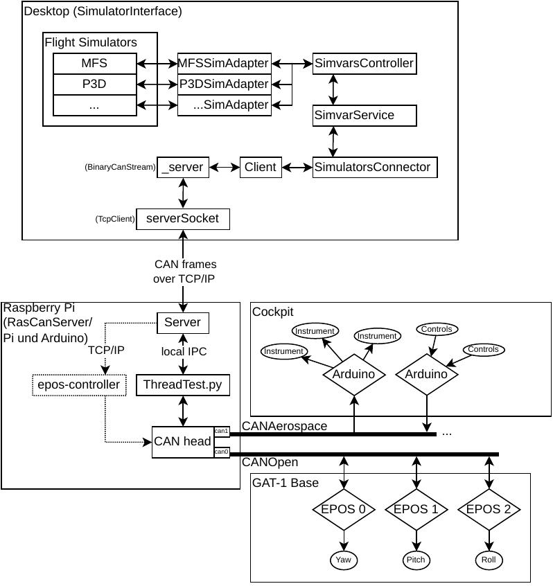
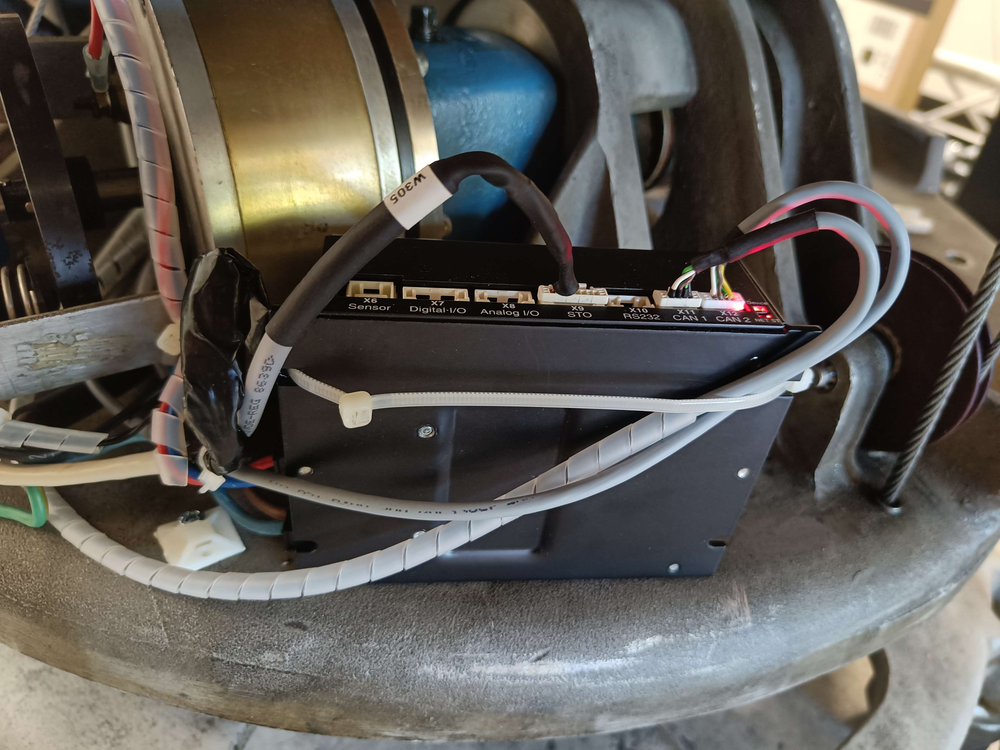

# Component overview



Lots of different programming languages are being used in this project. The main
program code is currently split into two repositories:

## epos-controller ([baseng0815/epos-controller](https://github.com/Baseng0815/epos-controller/))

EPOS4 code for motion control, written in C.

| location                                                                                       | description                              |
|------------------------------------------------------------------------------------------------|------------------------------------------|
| [./lib/](https://github.com/Baseng0815/epos-controller/tree/master/lib)                        | maxon libraries and sample code          |
| [./client/](https://github.com/Baseng0815/epos-controller/tree/master/client)                  | source code and Makefile                 |
| [./manuals/](https://github.com/Baseng0815/epos-controller/tree/master/manuals)                | maxon manuals                            |
| [./scripts/](https://github.com/Baseng0815/epos-controller/tree/master/scripts)                | utility scripts                          |
| [./Epos4-Node2.dcf](https://github.com/Baseng0815/epos-controller/tree/master/Epos4-Node2.dcf) |                                          |
| [./res/](https://github.com/Baseng0815/epos-controller/tree/master/res)                        | resources used to generate this document |

## simulator-interface ([cybermath2/simulator-interface/](https://github.com/cybermath2/simulator-interface/))

The rest, written mainly in C# and Python.

| location                                                                                                                             | description                                               |
|--------------------------------------------------------------------------------------------------------------------------------------|-----------------------------------------------------------|
| [./Pi und Arduino/Arduino/](https://github.com/cybermath2/simulator-interface/tree/main/Pi%20und%20Arduino/Arduino)                  | CAN code for Arduinos                                     |
| [./Pi und Arduino/Pi/ThreadTest.py](https://github.com/cybermath2/simulator-interface/blob/main/Pi%20und%20Arduino/Pi/ThreadTest.py) | important script interfacing with the CANaerospace bus    |
| [./CommonLogic/](https://github.com/cybermath2/simulator-interface/tree/main/CommonLogic)                                            | (high-level) shared logic like can frames, can streams... |
| [./RasCanServer/](https://github.com/cybermath2/simulator-interface/tree/main/RasCanServer)                                          | the central component connecting everything together      |
| [./SimulatorInterface/](https://github.com/cybermath2/simulator-interface/tree/main/SimulatorInterface)                              | responsible for interfacing with simulators (MFS, P3D...) |

# EPOS controller (`./epos-controller/`)

This piece of software represents the interface between the motion cueueing
program and the EPOS4 motor control devices. It is able to process various
simple commands over TCP/IP and is intended to run in the background as a
daemon. We chose TCP/IP as the interface to be independent of local IPC
mechanism and to allow distributed control of the simulator axes in case this
is desired in the future.



## Further reading (`./manuals/`)

| Name                                                                     | Description                                                               |
|--------------------------------------------------------------------------|---------------------------------------------------------------------------|
| [Application Notes](./manuals/EPOS4-Application-Notes-Collection-En.pdf) | Brief introductions to various topics and a general overview of procedure |
| [Firmware Specification](./manuals/EPOS4-Firmware-Specification-En.pdf)  | Firmware details like error codes, commands, modes and the state machine  |
| [Hardware Reference](./manuals/EPOS4-50-5-Hardware-Reference-En.pdf)     | Hardware details like pin assignments and wiring                          |
| [Command Library](./manuals/EPOS-Command-Library-En.pdf)                 | Command library documentation                                             |

## Building and dependencies

The EPOS Command Library header can be found in `./client/deps/` and serves as
an interface to its functions as well as a provider for constant definitions.
Dynamic libraries for ARMv{6,7,8} as well as i386 and amd64 for Linux to link
against can be found in lib/lib/. Please note these can be installed on the
system through the lib/install.sh script or by simply moving the dynamic
library files (libEposCmd.so.6.8.1.0, libftd2xx.so.1.4.8) into the
corresponding folder, usually /usr/local/lib/ on Linux systems.

The provided Makefile compiles the program and links it against the dynamic
libraries. The program can be built using `make` and the tree can be cleaned
using `make clean`.

## Technical background

We will give an overview of the main components and go further into detail on
potentially troublesome parts as well as on the communication protocol.

### CAN

All devices are connected together on a CAN bus and communicate through the
CANopen protocol. CAN resides on the physical and data link layer and CANopen
implements the network layer and above layers in the OSI model. CAN support for
the Raspberry Pi is achieved through a CAN head with two 3-pin connections
(H,L,G) sitting on top of it and kernel drivers exposing a CAN0 and CAN1
interface. This project uses a baud rate of 1000kbit/s and a timeout of 500ms,
so every interface and software port should be configured accordingly. CAN0 is
connected to CANOpen which is used for motion control and CAN1 to CANaerospace
which is used for instruments and control input. The driver used is
`CAN_mcp251x 0`. A script to set up an interface can be found in `./scripts/`.

Attention shold be given to proper wiring and a correct termination resistance
of 120 Ohms at the end of the bus. This can be realized by toggling DIP switch
7 to the ON position. DIP switches are also used for setting the id of each
node. Wiring errors usually manifest themselves in BUS-OFF errors and a
NO-CARRIER state on the interface. Interface state can be queried using `ip
-details link`.


Useful tools for debugging a CAN bus can be found in
[linux-can/can-utils](https://github.com/linux-can/can-utils) and include
`candump` for dumping CAN packages (useful to check whether a bus is dead as
devices shold be configured to send a periodic heartbeat message), `cangen` for
generation random traffic and `cansend` for sending a single CAN frame.

### EPOS4

Each of the three axes (yaw, pitch, roll) has one motor responsible for turning
it. This motor is controlled by an EPOS4 which has various control parameters
stored in non-volatile memory and works using three basic modes of operation:

1. position: move to an absolute or relative position
2. velocity: move with a target velocity
3. acceleration: apply a fixed acceleration to a motor

The user first initializes the EPOS4 by clearing a potential fault state and
enabling the device if it is currently disabled. Then the mode of operation is
set as well as profile parameters like acceleration and deceleration, maximum
velocity and so on. Only then can the device receive commands, compute a
trajectory and execute it with the help of various feedback loops from internal
sensors. A 5 second long move with a fixed velocity target for example could be
done in the following way:

1. get handle to CAN interface (hereinafter referred to by "port"), set
   baudrate and timeout
2. device in fault state? then clear fault
3. device disabled? then enable
4. set operation mode velocity
5. set velocity profile parameters (e.g. acceleration = deceleration =
   10'000rpm/s)
6. set target velocity (e.g. 250rpm)
7. sleep(5)
8. halt movement
9. disable

Controllers and torque are only activated when the device is in the enabled
state. This means that while the device is enabled, it cannot be moved by hand
and doesn't require an outside braking force to hold its position.

An extremely useful program for directly connecting to the EPOS, dynamically
configuring parameters and debugging problems is EPOS Studio for Windows
operating systems which can be downloaded from
[here](https://www.maxongroup.com/medias/sys_master/root/8994863841310/EPOS-2-4-IDX-Setup.zip).

The author of this document can in no way be held responsible for any material
or bodily harm incurred by improper use and/or faulty setups.

## Command set

This program receives and processes commands over TCP/IP with only one active
connection allowed at one time. On startup, it connects to the RasCanServer via
the `SERVER_IP` and `PORT` specified in `./client/constants.h`. Available
commands are as follows:

| Command             | Arg 0     | Arg 1        | Description                                                |
|---------------------|-----------|--------------|------------------------------------------------------------|
| `halt`              | -         | _            | Halt movement for all axes                                 |
| `position home`     | -         | -            | Seek home position for all three axes (NOT YET IMPLEMENTED)|
| `position absolute` | axis (%s) | target (%lf) | Seek an absolute target position in degrees for given axis |
| `position absolute` | axis (%s) | target (%lf) | Seek a relative target position in degrees for given axis  |
| `velocity`          | axis (%s) | target (%lf) | Set velocity for given axis                                |

## TODO

- implement homing with the help of external position sensors
- find accurate values for DEGTOINC and RPMTOVEL
- deal with position wrapping: contrary to what one might expect, commanding the
  EPOS to move to position 360deg from position 0deg results in the EPOS doing a
  whole turn instead of doing nothing. This is a problem when position input
  like the heading wraps around and causes the respective axis to do a
  full-speed, 360deg turn
- set software position limits for pitch and roll axes
- make movement more smooth by using velocities instead of positions
- in case a text-based TCP protocol is too slow, replace by/supplement with binary UDP protocol
- add additional commands
- if you feel fancy, restructure the code into multiple files

# RasCanServer (`simulator-interface/RasCanServer`)

The RasCanServer is the central part mediating communications between all other
components. Currently its job includes passing data between the
SimulatorInterface on the Windows machine and the CANaerospace bus by means of
the `../Pi und Arduino/Pi/ThreadTest.py` script as well as intercepting
motion-relevant messages, calculating a motion profile and sending these
commands to the epos\_controller.

```
                       epos_controller
                              ^
       ThreadTest.py <-> RasCanServer <-> SimulatorInterface
```

## Build instructions

Since the project is written in C#, we use the dotnet SDK to build a runnable
package. The following commands can be used to create a bundle and upload it to
the Raspberry Pi using the `rsync` utility:

```
dotnet publish --runtime linux-arm --self-contained && \
rsync -avu bin/Debug/net6.0/linux-arm/ \
mrfas@137.248.121.40:/home/mrfas/rascanserver
```

## TODO

- proper motion cueing for a three-axes flight simulator should be implemented
  to accurately model forces experienced by the pilot mid-flight
- the program crashes in some cases (probably a race condition), this should be
  debugged and fixed

# SimulatorInterface (`./simulator-interface/SimulatorInterface/`)

SimulatorInterface is responsible for communicating with the flight simulator
through the ISimAdapter and for managing input and output variables as defined
in `./datamodel/SimvarsInput.xml` and `./datamodel/SimvarsOutput.xml`. On
startup, it connects to the RasCanServer to send and retrieve flight simulator
data. To ensure proper redirection of variables defined in
`./datamodel/SimvarsOutput.xml` to the CANaerospace bus, make sure to set
`<iCanId>` and also `<eTransmissionSlot>`, otherwise no data will be sent. For
reference on how to implement ISimAdapter and navigate this callback jungle,
refer to `./steering/SteeringAdapter.cs`.

## TODO

- move `useSimulatortype` and other variables into an external config file so
  one doesn't need to recompile everything
